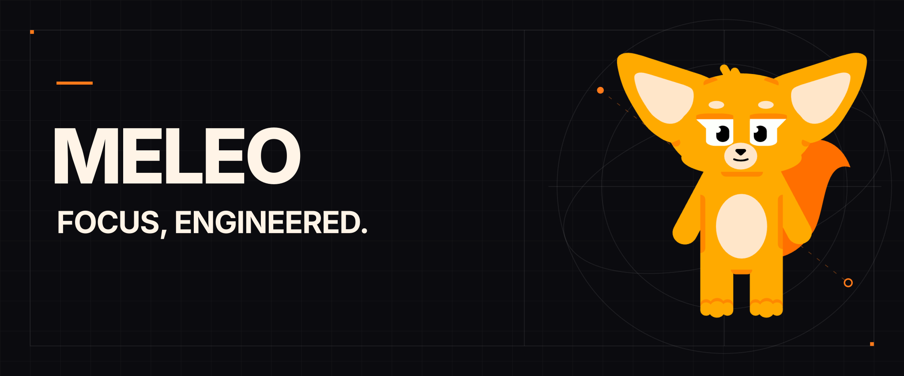
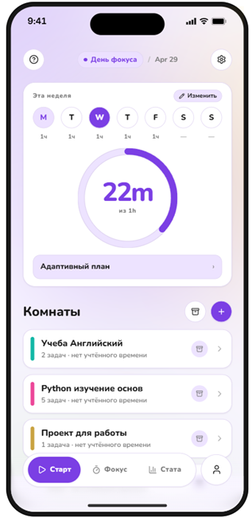
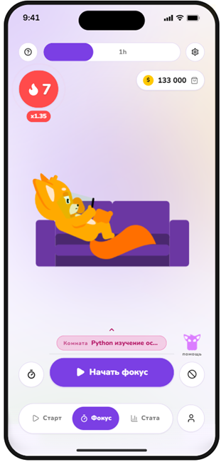
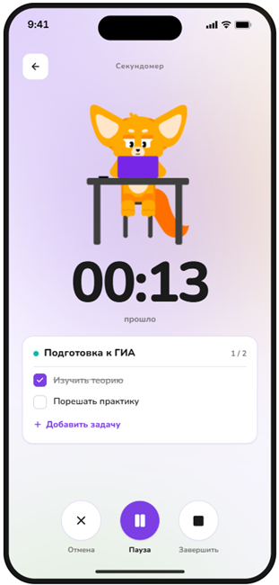
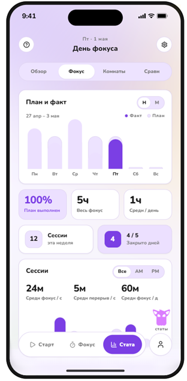
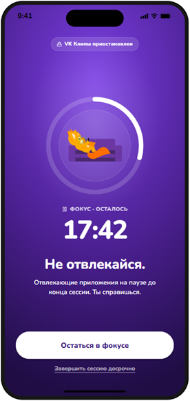
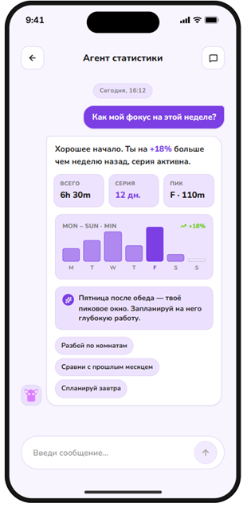
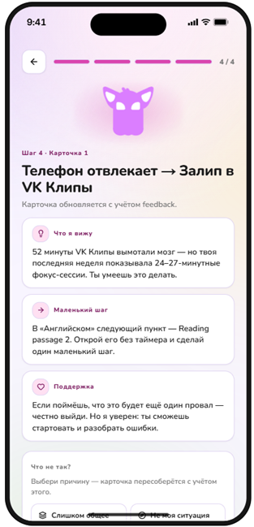
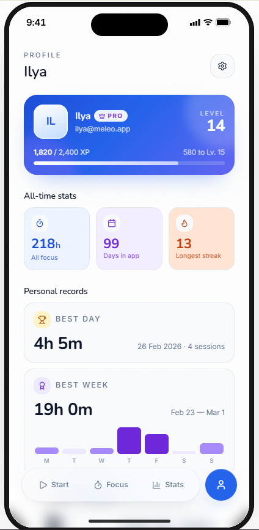
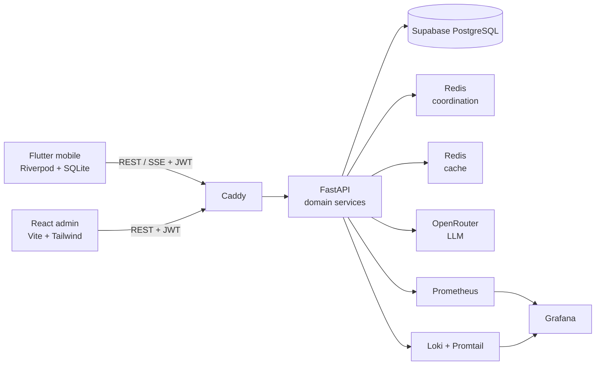

<p align="center">
  <strong>Интеллектуальная платформа продуктивности, которая превращает сфокусированную работу в измеримую и мотивирующую систему.</strong>
</p>

<p align="center">
  Flutter &nbsp;·&nbsp; FastAPI &nbsp;·&nbsp; PostgreSQL &nbsp;·&nbsp; Redis &nbsp;·&nbsp; React &nbsp;·&nbsp; Docker
</p>

> [!NOTE]
> Это очищенная инженерная демонстрация функционального прототипа. Внешние
> интеграции, рабочие учётные данные и закрытая конфигурация развёртывания
> намеренно исключены, поэтому репозиторий не позиционируется как окружение,
> готовое к запуску одной командой.

## О проекте

Meleo объединяет планирование задач, фокус-сессии, геймификацию, статистику и
два AI-сценария в одном продукте. Пользователь организует работу по
фокус-комнатам, выбирает задачи для сессии, отслеживает прогресс и получает
контекстную поддержку, когда начать работу сложно.

Проект демонстрирует не только интерфейс мобильного приложения, но и полный
инженерный контур: offline-first клиент, асинхронный API, доменную модель,
миграции PostgreSQL, административную панель, наблюдаемость и CI.

## Продуктовый walkthrough

Восемь экранов ниже показывают основной пользовательский сценарий: от плана
дня и запуска фокус-сессии до аналитики, блокировки отвлекающих приложений,
AI-помощников и профиля пользователя.

<table>
  <tr>
    <td align="center"></td>
    <td align="center"></td>
    <td align="center"></td>
    <td align="center"></td>
  </tr>
  <tr>
    <td align="center"></td>
    <td align="center"></td>
    <td align="center"></td>
    <td align="center"></td>
  </tr>
</table>

### Видео-демонстрация

[Открыть видео-демонстрацию в Google Drive](https://drive.google.com/file/d/1Fv6F5we53gxi7u4IzGXqVUbM8OttDELc/view?usp=sharing)

Видео показывает тот же пользовательский сценарий в динамике. Сам файл
намеренно не хранится в Git, чтобы сохранить репозиторий лёгким.

## Что реализовано

| Область | Реализация |
|---|---|
| Фокус и задачи | Комнаты, задачи, чек-листы, архивирование, сортировка, фокус-сессии и переключение активной задачи |
| Offline-first | Локальная SQLite-база, dirty-записи, cursor-based sync и адаптивный lifecycle синхронизации |
| Геймификация | XP, монеты, серии, recovery-механики, награды, магазин и скины маскота |
| AI-аналитика | SSE-чат с 28-дневным `FocusSnapshot`, tools и circuit breaker |
| JITAI | Сценарий «Не могу начать»: контекстный вопрос, карточка-договор, repair-цикл и статический fallback |
| Авторизация | Supabase Auth, OTP, JWT и изоляция пользовательских данных |
| Наблюдаемость | Prometheus, Grafana, Loki, Promtail, structlog, Sentry и PostHog |
| Администрирование | React SPA для продуктовой и серверной аналитики |

## Инженерные решения

### Изоляция сессии на мобильном клиенте

Flutter-клиент использует два `ProviderScope`. Внешний scope хранит состояние
сессии, а внутренний содержит доменные провайдеры и пересоздаётся при logout.
Так данные предыдущего пользователя не остаются в state graph. Доменные
команды сначала фиксируют изменения локально. `DomainOperationQueue`
сериализует операции чата и уведомлений, а active-room provider использует
собственную очередь. `SyncOrchestrator` управляет lifecycle sync-сервисов и
агрегированным pull.

### Синхронизация без требования постоянной сети

UI читает данные из SQLite, а доменные команды записывают локальные изменения.
Каждый доменный sync-сервис самостоятельно отправляет pending/dirty state в
API. `SyncOrchestrator` запускает и останавливает эти сервисы и выполняет
агрегированный pull по подписанному курсору и версиям пользовательского
состояния. Такой подход сохраняет отзывчивость интерфейса и делает сетевой
слой восстанавливаемым.

### AI как часть домена, а не отдельная демо-функция

AI-чат строит снимок реальной фокус-активности пользователя и использует
ограниченный registry инструментов для анализа статистики. Отдельный
JITAI-flow формирует строго валидируемый JSON и имеет fallback при ошибке
провайдера. Конкурентность ограничивается Redis-семафором и rate limiting.

### Наблюдаемая инфраструктура

API экспортирует Prometheus-метрики и структурированные JSON-логи с
`request_id`. `compose.prod.yml` описывает Caddy, API, admin SPA, две
инстанции Redis и стек Prometheus/Grafana/Loki/Promtail/Node Exporter. Это
инфраструктурный макет: реальные домены, секреты и окружение в showcase не
публикуются.

## Архитектура



Подробное описание компонентов и потоков данных:
[docs/architecture.md](docs/architecture.md).

## Структура репозитория

```text
meleo/
├── apps/
│   ├── mobile/          # Flutter-клиент
│   └── admin/           # React/Vite admin SPA
├── services/
│   └── api/             # FastAPI, домены, миграции и тесты
├── infra/               # Docker Compose, Caddy и observability
├── docs/                # Архитектура, процесс и разбор проекта
└── .github/workflows/   # CI для трёх частей проекта
```

## Проверяемость

Showcase сохраняет исходный код, миграционную историю и автоматические
проверки. На момент формирования репозитория применялись:

- `241` backend-тест;
- `150` mobile-тестов;
- `flutter analyze`;
- критические проверки Ruff;
- сборка административной панели для production;
- path-aware GitHub Actions workflow.

Команды запускаются из корня репозитория:

```bash
cd apps/mobile
flutter analyze
flutter test

cd ../../services/api
ruff check backend/ --select E9,F63,F7,F82
pytest backend/ -v

cd ../../apps/admin
npm run build
```

Установка зависимостей и заполнение example-конфигураций необходимы отдельно.
Реальные `.env` в репозиторий не входят.

## Roadmap

Roadmap показывает направление развития Meleo после текущей демонстрационной
версии. Статусы разделяют готовые возможности и задачи, для которых ещё нужны
разработка, исследование или внешние интеграции.

| Статус | Направление | Что входит |
|---|---|---|
| `DONE` | Основной пользовательский цикл | Фокус-комнаты, задачи, чек-листы, таймер, завершение сессии и статистика |
| `DONE` | Offline-first мобильный клиент | Локальная SQLite-база, dirty-записи, cursor-based sync и lifecycle синхронизации |
| `DONE` | AI-сценарии | Агент статистики, JITAI-flow «Не могу начать», tools, SSE и fallback-механики |
| `DONE` | Платформенный контур | FastAPI, PostgreSQL, Redis, миграции, React admin и observability stack |
| `DONE` | Инженерное качество | Тесты мобильного клиента и backend, критические lint-проверки и GitHub Actions CI |
| `NEXT` | Полировка продуктового цикла | Расширение onboarding, уведомлений, экранов помощи и UX-состояний |
| `DONE` | Более глубокая аналитика | Сравнение периодов, динамика привычек, персональные рекомендации и экспорт статистики |
| `DONE` | Надёжность синхронизации | Расширенное разрешение конфликтов, повторная доставка операций и диагностика offline-состояний |
| `DONE` | Мобильная платформа | Интеграция iOS Screen Time API и публикационная подготовка Android/iOS-клиентов |
| `NEXT` | Коммерческий контур | Подписка Pro, платежи, тарифные ограничения и управление entitlement-состоянием |
| `NEXT` | Production readiness | Staging-окружение, автоматические backup-процедуры, security-аудит и нагрузочные прогоны |
| `RESEARCH` | Расширение AI | Персональный планировщик, долгосрочная память предпочтений и новые доменные tools |
| `RESEARCH` | Интеграции | Публичный API, календарь, внешние трекеры задач и импорт истории продуктивности |

Roadmap не является обещанием фиксированных сроков: приоритеты могут меняться
после тестирования, обратной связи и проверки внешних платформенных API.

## Документация

- [Архитектура](docs/architecture.md)
- [Инженерный разбор проекта](docs/presentation.md)
- [Процесс разработки и качество](docs/development-process.md)
- [Мобильное приложение](apps/mobile/README.md)
- [Навигация по документации](docs/README.md)
- [Правила участия](CONTRIBUTING.md)
- [Политика безопасности](SECURITY.md)
