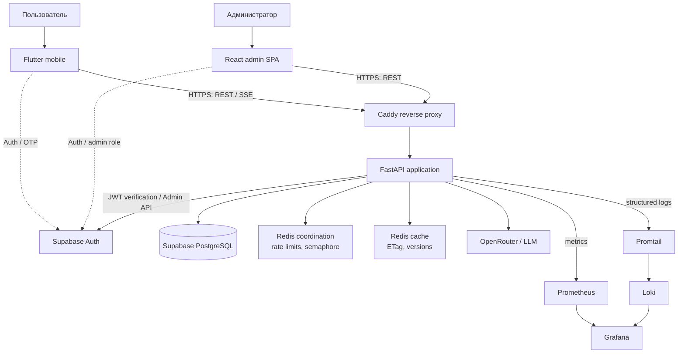
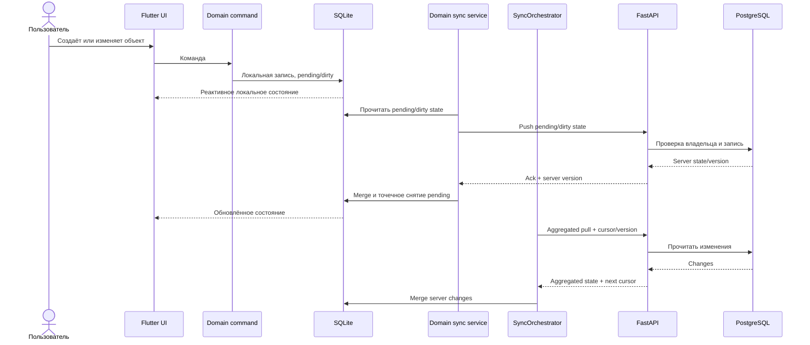
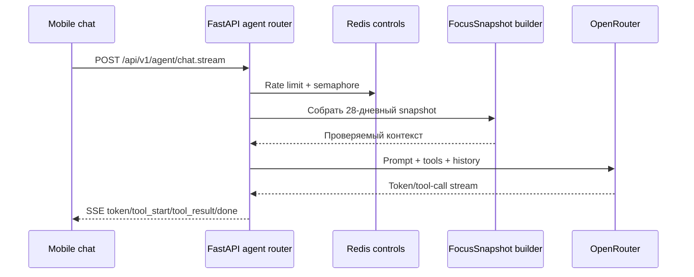
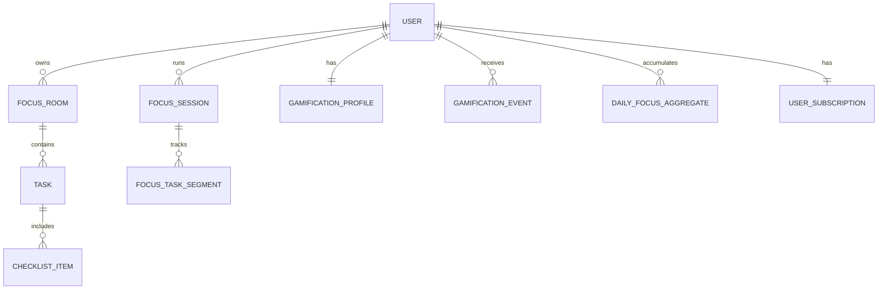

# Архитектура Meleo

## 1. Контекст системы

Meleo состоит из двух клиентов, единого backend API и набора управляемых и
контейнерных сервисов. Мобильный клиент предназначен для основной работы
пользователя, admin SPA — для аналитики. FastAPI остаётся доверенной границей
для бизнес-данных и внешних интеграций.



`compose.prod.yml` описывает десять контейнерных сервисов: `caddy`, `api`,
`admin`, `redis-coordination`, `redis-cache`, `loki`, `promtail`,
`prometheus`, `node_exporter` и `grafana`. PostgreSQL и Auth предоставляются
Supabase, а LLM — внешним провайдером. Showcase не содержит значений,
необходимых для фактического production-развёртывания.

## 2. Разделение ответственности

### Мобильный клиент

`apps/mobile` — Flutter-клиент с feature-oriented структурой:

- `lib/core` — окружение, сеть, SQLite, session scope, sync и общие сервисы;
- `lib/features` — auth, focus, chat, notifications, statistics, profile,
  search, subscription и shell;
- `android` — native bridge прототипа блокировки приложений;
- `test` — unit и widget tests.

Riverpod разделён на внешний и внутренний `ProviderScope`. Внешний scope
переживает logout и хранит состояние сессии. Внутренний содержит доменные
провайдеры и полностью пересоздаётся при завершении сессии.

### API

`services/api/backend` организован по слоям:

```text
apps/api/          HTTP, middleware, schemas, dependency injection
apps/agent/        AI orchestration, prompts, tools, JITAI
domain/            entities, repository protocols, business services
infrastructure/    SQLAlchemy repositories, Redis, security, metrics, logging
alembic/           schema migrations
tests/             unit, integration-shaped, e2e helpers and load test
```

Роутеры покрывают auth, users, rooms/tasks, sessions, gamification, plan,
sync, chat, AI, JITAI, notifications, announcements, profile statistics,
mascot skins и admin analytics.

### Административная панель

`apps/admin` — React 18 SPA. Supabase session предоставляет JWT, API-клиент
передаёт его FastAPI, а backend повторно проверяет admin role. В интерфейсе
представлены продуктовая и серверная аналитика.

## 3. Поток данных offline-first

UI мобильного приложения не зависит от мгновенного ответа API: чтение идёт из
SQLite, а сеть синхронизирует локальное состояние.



Ключевые свойства:

- доменные команды сначала записывают изменение в локальное хранилище;
- `DomainOperationQueue` применяется для сериализации операций чата и
  уведомлений, а active-room provider имеет отдельную очередь;
- каждый доменный sync-сервис самостоятельно выполняет push;
- `SyncOrchestrator` управляет lifecycle сервисов и агрегированным pull;
- агрегированный `/api/v1/sync` сокращает количество сетевых запросов;
- версии состояния и курсор позволяют получать только изменения;
- пользовательская сессия входит в контекст локальных данных и sync lifecycle.

## 4. AI-сценарии

В проекте два независимых сценария.

### Агент статистики фокуса



Tools ограничены registry `TOOLS_BY_VARIANT` и включают получение среза
статистики, сравнение периодов и оценку плана. Circuit breaker предотвращает
каскадные вызовы при проблемах LLM-провайдера.

### JITAI «Не могу начать»

JITAI получает краткий контекст текущего дня, формирует вопрос и затем
карточку-договор. Ответ модели должен соответствовать фиксированной JSON-форме.
При невалидном JSON или сетевой ошибке возвращается статический fallback.
Отрицательная реакция пользователя запускает repair-цикл с новой гипотезой.

## 5. Данные и домены

Основные связи:



Доступ к доменным таблицам проходит через backend. Репозитории фильтруют
операции по `user_id`; Alembic хранит эволюцию схемы. Каноническая связь с
Supabase Auth строится по `supabase_user_id`.

## 6. Надёжность и наблюдаемость

- `request_id` связывает HTTP-ответ и структурированный лог.
- Prometheus middleware измеряет latency и HTTP status distribution.
- Redis с `noeviction` используется для координационных ключей; отдельный
  `allkeys-lru` instance — для восстанавливаемого cache state.
- Grafana объединяет Prometheus-метрики и Loki-логи.
- Mobile интегрирован с Sentry и PostHog.
- CI независимо проверяет mobile, API и admin по изменённым путям.

## 7. Границы доверия

Наиболее чувствительные границы:

1. Supabase JWT → внутренний пользователь;
2. admin role → административные endpoints;
3. локальная SQLite-база → смена аккаунта;
4. sync cursor/version → server state;
5. AI tool registry → доменные данные;
6. example-конфигурация → реальные deployment secrets.

Эти области требуют целевых тестов и отдельного review при изменениях.

## 8. Ограничения

- Репозиторий не содержит production credentials и не воспроизводит закрытые
  внешние интеграции без дополнительной настройки.
- Android app blocker является platform-specific прототипом; iOS parity нет.
- Billing для Pro не подключён.
- Celery объявлен зависимостью, но текущий runtime не содержит worker/task
  entrypoints.
- Схема production-развёртывания описана в коде, но не заявляется как публично
  развёрнутая из этого showcase.
